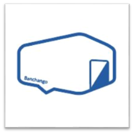
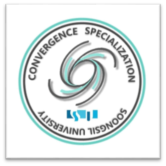
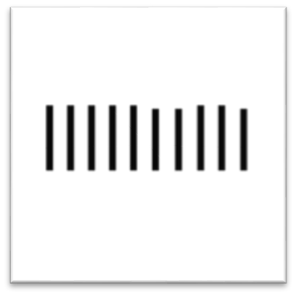
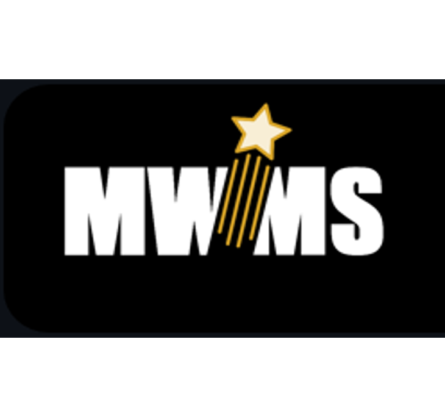
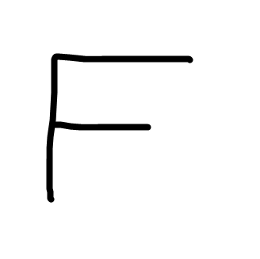
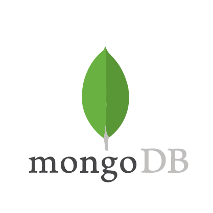

# 🥇 Projects with Awards
<table>
  <tr>
    <td align="center" width="500">
      
       <b>2020 | 모두의 하루</b>
    </td>
    <td align="center" width="500">
      
       <b>2020 | 반창고 허브</b>
    </td>
    
  </tr>
    <tr>
        <td align="center" width="500">
            행복을 습관화하는 습관 SNS
        </td>
        <td align="center" width="500">
            풀필먼트, 3PL 물류창고 중개 플랫폼
        </td>
    </tr>
    <tr>
        <td align="center" width="500">
            <b>🥇2020 OTHON 오픈소스 해커톤 장려상</b>
        </td>
        <td align="center" width="500">
            <b>🥇2020 서울시 SBA 창업 대회 종합 대상</b>
             <b>🥇2020 KDB 창업교육 미니IR 대상</b>
        </td>
    </tr>
</table>
<table>
  <tr>
    <td align="center" width="500">
      
       <b>2021 | 운동만해</b>
    </td>
    <td align="center" width="500">
      
       <b>2022 | 이동중 이상무</b>
    </td>
  </tr>
  <tr>
    <td align="center" width="500">
        AI, 메타버스를 이용한 운동 추적 관리 서비스
    </td>
    <td align="center" width="500">
        예비군 장병 카풀 매칭 서비스
    </td>
  </tr>
  <tr>
    <td align="center" width="500">
        <b>🥇2021 숭실대학교 컴퓨터학부 소프트웨어 공모전 금상</b>
    </td>
    <td align="center" width="500">
      <b>🥇2022 국방공공데이터경진대회 한국IT산업협회장상</b>
    </td>
  </tr>
</table>

## 🏅 Other Awards
**🏅2008 한국로봇올림피아드 서울 은상, 전국 장려상** 
**🏅2012 제45회 과학의날 교육과학기술부장관상** 
**🏅2012 한국정보올림피아드 전국대회 은상**

# 🍻 Toy Projects

<!-- > Tools, languages, and other things that I like to work with. -->

<table>
  <tr>
    <td align="center" width="500">
      
       <b>2021 | SSYUNG</b>
    </td>
    <td align="center" width="500">
      
       <b>2022 | Barcode Nickname Generator</b>
    </td>
  </tr>
  <tr>
    <td align="center" width="500">
      숭실대 융합특성화자유전공학부 커뮤니티
    </td>
    <td align="center" width="500">
      Generate your random barcode nickname like lIllIllI
    </td>
  </tr>
</table>
<table>
  <tr>
    <td align="center" width="500">
      
       <b>2022 | 국방물자관리체계</b>
    </td>
    <td align="center" width="500">
      
       <b>2022 | Finance Telegram Bot</b>
    </td>
  </tr>
  <tr>
    <td align="center" width="500">
      군 물류창고 정리를 웹에서 할 수 있게 해주는 군대판 WMS
    </td>
    <td align="center" width="500">
      Receive economic info everyday via Telegram
    </td>
  </tr>
  
</table>

# 🧰 Favorite Tech

> Tools, languages, and other things that I like to work with.

<table>
  <tr>  
    <td align="center" width="96">
      
       TypeScript
    </td>
    <td align="center" width="96">
      
       Python
    </td>
    <td align="center" width="96">
      
       C#&nbsp;(Core)
    </td>    
    <td align="center" width="96">
      
       React
    </td>
    <td align="center" width="96"> 
      
       Docker
    </td>
    <td align="center" width="96">
      
       Powershell
    </td>
    <td align="center"  width="96">
      
       MySQL
    </td>
  </tr>
  <tr>
    <td align="center"  width="96">
      
       MongoDB
    </td>
    <td align="center"  width="96">
      
       VSCode
    </td>
  </tr>
</table>